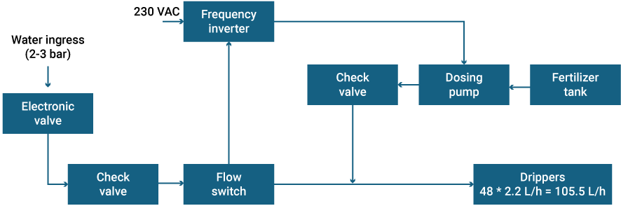
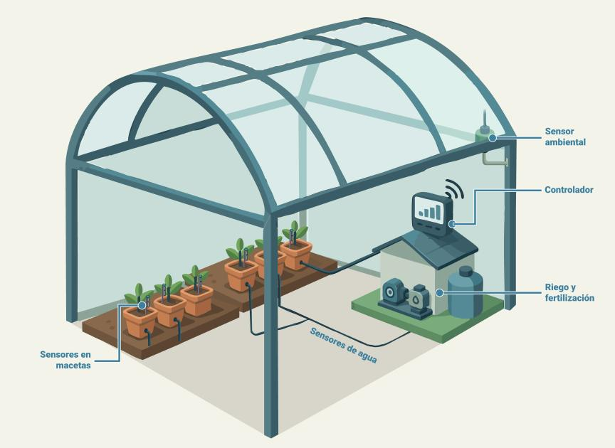
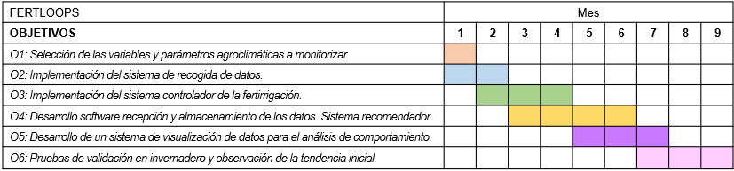

# Fertloops: Sistema de fertirrigación de bucle cerrado

**Área de conocimiento:** Botánica y Fisiología Vegetal

## Resumen de la propuesta

En la actualidad el mundo agrícola está sufriendo grandes cambios en lo que respecta a su tecnificación (Pandey, 2022), (Ruiz-Real, 2020) y (Getahun, 2024). Cada vez es más habitual que existan cultivos con monitorización de las variables que afectan al cultivo para conseguir un control de los parámetros asociados tanto propios de la planta como del entorno: suelo, ambiente o agua (Steffen, 2019). Adicionalmente, debido a las propiedades que tienen las explotaciones modernas y a las necesidades específicas de los tipos de cultivo, se hace cada vez más necesario tener control, principalmente, del riego, pero también de sistemas de fertilización o de ventilación en invernaderos. Así, integrando estos sistemas de ayuda técnica se ha conseguido una evolución a la denominada agricultura 4.0 (Monteleone, 2020) y (Barrile, 2022).

En este sentido, se han estudiado ampliamente los diferentes parámetros asociados a los cultivos y el efecto que tienen estos en el desarrollo de las plantas. En el mercado pueden encontrarse diferentes sensores que permiten monitorizar multitud de parámetros:

- Suelo: temperatura, humedad y conductividad eléctrica.
- Agua: cantidad de agua aplicada, pH y conductividad.
- Ambiental de invernadero: temperatura, humedad relativa, radiación solar y viento.
- Ambiental en exteriores: pluviometría.

Existen otros parámetros adicionales que pueden ser monitorizados y algunos otros agroclimáticos que pueden derivarse de estos: evapotranspiración, déficit de presión de vapor, integral térmica u horas de frío, entre otros. En lo que respecta a la actuación, es común encontrar diferentes sistemas con control automatizado de riego, generalmente, en base a un régimen temporal.

El objetivo principal del prototipo que se pretende construir es cerrar el bucle entre la monitorización y la actuación en cultivos agrícolas. Así, se pretende conseguir mejorar la calidad y homogeneizar los cultivos, aumentar la productividad frente a la cantidad de recursos invertidos al aplicar tanto el riego como los fertilizantes en el momento adecuado y la reproducibilidad al conocer y poder controlar exactamente las condiciones que han desembocado en buenas cosechas.

### Referencias

- Pandey et al. 2022. Chapter 1 - Smart agriculture: Technological advancements on agriculture—A systematical review. Editor(s): Ramesh Chandra Poonia, Vijander Singh, Soumya Ranjan Nayak. *Deep Learning for Sustainable Agriculture - Cognitive Data Science in Sustainable Computing*. Academic Press: 1-56. ISBN 9780323852142.
- Ruiz-Real et al. 2020. A Look at the Past, Present and Future Research Trends of Artificial Intelligence in Agriculture. *Agronomy* (10), 1839.
- Getahun et al. 2024. Application of Precision Agriculture Technologies for Sustainable Crop Production and Environmental Sustainability: A Systematic Review. *Scientific World Journal*. (9) 2126734.
- Steffen et al. 2019. A comparison of global agricultural monitoring systems and current gaps. *Agricultural Systems* (168): 258-272.
- Monteleone et al. 2020. Exploring the Adoption of Precision Agriculture for Irrigation in the Context of Agriculture 4.0: The Key Role of Internet of Things. *Sensors (Basel)* 20(24):7091.
- Barrile et al. 2022. Experimenting Agriculture 4.0 with Sensors: A Data Fusion Approach between Remote Sensing, UAVs and Self-Driving Tractors. *Sensors (Basel)* 22(20):7910.

## Descripción técnica de la propuesta

A nivel global, la agricultura consume aproximadamente el 85% del agua dulce disponible (FAO, 2022) debido a la mayor demanda de alimentos por el crecimiento constante de la población se hace necesario el uso de estrategias de riego de precisión y para garantizar la seguridad alimentaria y promover el ahorro de agua. El sistema tradicional de gestión del riego presenta problemas como una baja eficiencia en el uso del agua lo que se traduce en una productividad limitada. Además, las condiciones variables del entorno requieren un enfoque adaptativo, utilizando sistemas de riego de precisión que incorporen tecnologías como sensores para medir la conductividad eléctrica del suelo, la evapotranspiración de las plantas o el nivel de clorofilas entre otros. Aunque en un invernadero se puede controlar el ambiente, estos factores son más difíciles de gestionar en un cultivo al aire libre. Actualmente se está haciendo uso de nuevas tecnologías como los gemelos digitales para llevar a cabo un riego inteligente, así como la fertirrigación, donde los nutrientes se mezclan con el agua de riego. Esto hace necesario una programación óptima del uso de fertilizantes para administrar la dosis correcta en el momento en que se requiera. Para ello es imprescindible tener en cuenta un volumen alto de datos tanto ambientales, de características del suelo o datos fisiológicos del cultivo en cuestión.

Ferloops, se basa en un sistema de fertirrigación de bucle cerrado para economizar el uso del agua y hacer una utilización eficiente de los fertilizantes de manera que se facilite el manejo de explotaciones agrarias de cultivos de interés agrícola. La Figura 1 presenta el sistema de control y dosificación de fertilizante que se pretende construir.

Fertloops no solo pretende mejorar la productividad, sino que también busca alinearse con los Objetivos del Desarrollo Sostenible (ODS) y con la Estrategia de Especialización Inteligente 2021-2027 RIS3 de la Junta de Castilla y León para la mejorar y economizar el uso de agua y fertilizantes. Uno de los beneficios del desarrollo de esta nueva agricultura sería la reducción de la lixiviación de nitratos al suelo, que es uno de los principales problemas de la agricultura intensiva. La implementación de este sistema de fertirrigación se podrá establecer un sistema de monitorización sólido que permita la captación de datos a tiempo real de las condiciones ambientales y de sustrato para, posteriormente, poder caracterizar el valor óptimo de esos parámetros en el desarrollo de cultivos.

*Figura 1: Modelo propuesto del sistema de fertirrigación automático.*

Para la ejecución de Fertloops se dispondría de uno de los módulos del invernadero del Instituto de Investigación en Agrobiotecnología (CIALE) de la Universidad de Salamanca. Este invernadero está equipado con sondas para el monitoreo y registro de la humedad y temperatura, y de sistemas de ventilación y calefacción para mantener dichas condiciones dentro de unos límites adecuados para el crecimiento de las plantas (ver esquema en la Figura 2). El dispositivo de monitoreo tiene configuradas unas alarmas que detectan situaciones anormales y producen una señal de alerta para tener una respuesta lo más temprana posible.

*Figura 2: Esquema del invernadero con el equipamiento disponible: controladores, sistema de riego y fertilización, sensores de agua, de sustrato en las macetas y los sensores ambientales.*

Dentro del módulo del invernadero se dispondrían de varias mesas de drenaje en las que se puedan separar las condiciones de cultivo. En cada una de ellas se podrían realizar pruebas con variaciones en los niveles de irrigación y fertilización, por ejemplo, variando la concentración de nitratos tal y como aparecen en el siguiente esquema (Figura 3).

La fertirrigación se regularían mediante un programador de riego (válvula electrónica) y un sistema de inyección de fertilizante equipado con bombas, variadores de frecuencia, flujostatos y caudalímetros. Todos estos datos serían recopilados e introducidos en algoritmos para ajustar al máximo las variables de aporte de agua y fertilizante y generar así modelos predictivos basados en inteligencia artificial. Además, las condiciones del cultivo se controlarán a través de un sistema de monitoreo constante mediante sondas para detectar cualquier incidencia en el riego automático y poder solventarlo con la mayor brevedad posible. Las sondas se acoplarían directamente en los sustratos de cultivo y se registrarán datos sobre la humedad, CE y temperatura a tiempo real que quedarían registrados en un sistema de almacenamiento de datos para su posterior análisis.

*Figura 3: Diseño del módulo donde se muestra la disposición que tendría el sistema de riego con los sacos de fibra en las mesas de drenaje, las líneas de riego (R: toma de agua), los tanques de fertilizante (D) y el sistema de automatización del riego (T: programador de riego; C: caja con los equipos de bombeo).*

El plan de trabajo para conseguir alcanzar el objetivo (O) principal de Fertloops de construir un prototipo para cerrar el bucle entre la monitorización y la actuación en cultivos agrícolas se divide en 6 objetivos distintos. Se comenzará con la selección de las variables a monitorizar en el cultivo piloto que se implemente y definición de los parámetros agroclimáticos de interés para el estudio (O1, mes: 1). A continuación, se seleccionarán las variables a monitorizar en el cultivo piloto que se implemente y se definirán los parámetros agroclimáticos de interés para el estudio (O2, mes: 1-2). Se pasará a la implementación de un sistema controlador compatible con equipamiento de gestión de bombas y/o válvulas de riego y dosificación de fertilizante de forma controlada (O3, mes: 2-4). Se desarrollará un software para recepción de los datos, almacenamiento de los mismos en una base de datos y creación de un sistema recomendador basado en un motor decisor (simple o basado en algoritmos) (O4, mes: 3-6). Posteriormente, se desarrollará un sistema de visualización de datos para el análisis de comportamiento del sistema (O5, mes: 6-8). Por último, se realizarán las pruebas de validación en un escenario piloto en un invernadero con un conjunto limitado de plantas y observación de la tendencia inicial (O6, mes:6-12).

**Gantt chart de la distribución temporal de los objetivos planteados:**

### Referencias

- FAO. 2022. *The State of the World's Land and Water Resources for Food and Agriculture – Systems at breaking point*. Main report. Rome.

## Aspectos innovadores del proyecto

Este proyecto presenta numerosas ideas innovadoras y está perfectamente alineado con las Áreas de Investigación de la agenda 2030. Particularmente, está centradas con aquellas relacionadas con la sostenibilidad en términos generales, la preservación del agua y la garantía de que haya alimentos para todos.

En este caso, se presentan algunos de los puntos clave de innovación de este proyecto.

| Área de investigación | Innovación tecnológica |
| --- | --- |
| Optimización de recursos | Mediante un sistema de bucle cerrado como el que se propone se pueden optimizar al máximo los recursos aplicados, tanto el riego como la fertilización. Esto se debe a que al monitorizar exactamente el estado de la planta se puede aplicar lo demandado y mantener la planta en el estado óptimo para su producción y crecimiento. |
| Automatización de tareas | Una vez que se conocen las medidas exactas de los diferentes parámetros de interés, se pueden controlar de forma automática los actuadores necesarios para conseguir cerrar el bucle. Así, muchas de las tareas realizadas de forma manual o automatizadas temporalmente, es decir, para que funcionen a una hora o durante un tiempo determinado pueden hacerse a demanda cuando el propio cultivo demande. Esto habilita un escenario de autogestión automática que permite evitar decisiones equivocadas o dependencia absoluta de un técnico de campo a la hora de tomar decisiones en momentos concretos. |
| Adaptabilidad y previsión | Al tratase de un sistema automático y basado en parámetros objetivos podrían establecerse reglas automáticas de funcionamiento que permitiesen adaptarse a unas circunstancias cambiantes. De esta manera, el sistema podría anticiparse a posibles episodios de estrés para el cultivo como temperaturas extremas, tormentas o heladas. |
| Escenarios inteligentes | Mediante un sistema de este tipo que tiene todos los datos y el control completo, podrían detectarse posibles problemas en la infraestructura como, por ejemplo, roturas de tuberías. Adicionalmente, mediante el análisis de los datos, podrían realizarse tareas de mantenimiento preventivo que, a la larga, suponen un ahorro en la inversión necesaria y un coste oportunidad más asequible. |

## Problema que soluciona

Ante la cada vez más evidente falta de recursos naturales se hace imprescindible conseguir optimizar el gasto energético, de materias primas y de agua en todos los ámbitos industriales y productivos. Este hecho es especialmente interesante en la agricultura donde debe racionalizarse y convertir en sostenible el consumo tanto de agua como de productos químicos utilizados para mejorar la calidad y la cantidad de la producción. Así, el sistema que se propone permite a partir de medidas objetivas de los parámetros de interés conseguir adecuar la dosificación en el riego y en los tratamientos de fertilización exactamente a lo que planta necesita o demanda en cada momento.

De esta manera, mediante esta herramienta se pretende conseguir cultivos más razonables desde todos los puntos de vista pudiendo conseguir replicar las condiciones entre campañas, lo que también aumentará la homogenización no sólo en la misma campaña sino entre campañas de cultivo sucesivas.

Así mediante la construcción de un piloto automatizado y una primera recogida de datos se pueden establecer algunas condiciones para actuación condicionada a los parámetros monitorizados. A largo plazo, una vez que se han obtenido los datos de varias campañas en una o varias localizaciones, sería posible entrenar modelos de inteligencia artificial para el control sostenible de las plantas bajo producción.

## Objetivo de la propuesta

El objetivo principal del prototipo que se pretende construir es cerrar el bucle entre la monitorización y la actuación en cultivos agrícolas. Así, se pretende conseguir mejorar la calidad y homogeneizar los cultivos, aumentar la productividad frente a la cantidad de recursos invertidos al aplicar tanto el riego como los fertilizantes en el momento adecuado y la reproducibilidad al conocer y poder controlar exactamente las condiciones que han desembocado en buenas cosechas.

Para conseguir este objetivo principal se establecen una serie de objetivos parciales que permitirán la consecución del objetivo global y por lo tanto del proyecto. Los objetivos parciales son los siguientes:

- **O1:** Selección de las variables a monitorizar en el cultivo piloto que se implemente y definición de los parámetros agroclimáticos de interés para el estudio.
- **O2:** Implementación de un sistema de recogida de datos a partir de los sensores desplegados en un cultivo y envío a una entidad software de jerarquía superior para su posterior almacenamiento.
- **O3:** Implementación de un sistema controlador compatible con equipamiento de gestión de bombas y/o válvulas de riego y dosificación de fertilizante de forma controlada.
- **O4:** Desarrollo de software para recepción de los datos, almacenamiento de los mismos en una base de datos y creación de un sistema recomendador basado en un motor decisor. Este sistema decisor puede ser simple o estar basado en algoritmos pre-entrenados de inteligencia artificial.
- **O5:** Desarrollo de un sistema de visualización de datos para el análisis de comportamiento del sistema.
- **O6:** Pruebas de validación en un escenario piloto en un invernadero con un conjunto limitado de plantas y observación de la tendencia inicial.

### Alineación con la RIS3 2021-2027 de Castilla y León

¿El proyecto está alineado con alguno de los ámbitos sectoriales identificados en el proceso de elaboración de la RIS3 2021-2027 de Castilla y León? **Sí**

Ámbitos del proyecto:

- **1.- Agroalimentario:** agricultura, ganadería e industria alimentaria
- **5.- Energía y medioambiente**

## Identificación de posibles usuarios y aplicabilidad

Los posibles usuarios del sistema son todas las personas del sector primario dedicados a la producción agrícola. Así podrían beneficiarse de las bondades otorgadas por un sistema de control del riego y de la fertilización en bucle cerrado tanto aquellos productores al aire libre como los viveristas con producción en invernadero. Bien es cierto que la producción en invernadero a priori es más fácilmente controlable, en los cultivos al aire libre pueden hacerse predicciones muy concretas de factores ambientales que pueden llevar a un correcto manejo del cultivo basado en parámetros medidos.

Por lo tanto, una vez que se haya implementado el piloto para la gestión de riego y fertilización de un conjunto limitado de plantas y su funcionamiento tenga resultados prometedores, la idea sería extrapolarlo a una explotación más real de manera que pueda estudiarse el efecto a mayor escala de forma comparativa con los resultados históricos. Con un ajuste fino mediante inteligencia artificial del sistema, sería posible anticiparse a posibles problemas y conseguir una homogenización de diferentes cosechas.

## Estado de protección del objeto del proyecto

Actualmente, no está protegido el sistema que se propone ni su aplicación ya que se trata de una idea novedosa.

## Propuesta de posibles modelos de comercialización

Este producto creado podrá ser comercializado de dos formas diferentes:

- Para aquellas explotaciones que ya tienen sistemas de monitorización o actuación abiertos, es decir, que permitan la lectura de los datos o la interacción con los sistemas a controlar, el sistema puede ser comercializado como un Software as a Service (Saas), es decir, el sistema decisor puede crearse con una serie de conectores genéricos que permitan su conexión con otros sistemas propietarios ya instalados (siempre que los sistemas propietarios permitan esta operación).
- Por otro lado, si la explotación interesada no dispone de ninguna tecnología de control o monitorización, se podría realizar una consultoría previa para conocer las necesidades específicas y una vez estudiado el caso, ofrecerle una solución llave en mano de monitorización y control, con el sistema decisor como elemento Saas. De esta manera, se consigue una fidelización del cliente con pago recurrente. Para esto es necesario conseguir un nivel de madurez del producto más elevado antes de llevarlo a explotaciones reales.

Para llegar a un sistema a gran escala los principales costes que requeriría serían:

- Mantenimiento de servidores y del sistema global de control
- Mantenimiento de la instalación in situ: sensores, data-loggers y sistema de fertirrigación.
- Equipo multidisciplinar de ingenieros: electrónicos, informáticos y agrónomos, fundamentalmente para el diseño de la solución e integración en las instalaciones de la explotación.
- Equipo de desarrollo de las posibles mejoras que sean necesarias.
- Soporte técnico.
- Asistencia a eventos, divulgación y publicidad.

La propuesta actual pretende presentar una herramienta como prueba piloto para controlar el riego en base a diferentes parámetros monitorizados. Por lo tanto, sería de aplicación en todo tipo de cultivos siempre que estos dispongan de los elementos necesarios para su monitorización y control. Así, la idea es poder aplicarlo en todo tipo de cultivos ya sean al aire libre o viveros de plantas hortícolas, ornamentales o frutos rojos.

Para una mayor difusión se valorará la realización de diferentes actuaciones como comunicaciones congresos, asistencia a ferias y eventos del sector, o publicaciones científicas.

## Resultados esperados

Los resultados que se espera conseguir una vez que se haya completado el proyecto se resumen en la siguiente lista:

- Equipo de monitorización completo de parámetros de interés mediante sensores y acondicionamiento de estos datos para conseguir variables agroclimáticas de interés.
- Equipamiento necesario para control de riego y dosificación de fertilizante. Es fundamental poder dosificar en base a las necesidades específicas de la planta en cada caso, por lo tanto, el sistema de riego y el de fertilización deben tener independencia.
- Sistema que permita el cierre completo del bucle controlar los actuadores en base a las magnitudes monitorizadas. Este sistema fundamentalmente software incorporará una base de datos y un sistema que permitirá establecer, en primera instancia, diferentes umbrales, pero a posteriori tomar decisiones mediante algoritmos de inteligencia artificial basados en datos históricos.
- Finalmente, con el objetivo de visualización de los datos, se creará una interfaz sencilla que permita visualizar los datos registrados y hacer gráficas históricas para poder observar tendencias.

## Inversión prevista para el proyecto (presupuesto)

En el presupuesto se incluyen diferentes partidas:

**Suministros:**

- Material electrónico de monitorización ambiental, de suelo y de planta. Es necesario adquirir o desarrollar con alguna placa de prototipado existente equipamiento de recogida de datos y sensores: 2000€.
- Material necesario para control de riego y control de bombas dosificadoras de fertilizante: 1000€

**Servicios:**

- Servicio de diseño mecánico para invernadero: 500€
- Servicio de mantenimiento de servidores necesarios para la ingesta de datos y ejecución del sistema recomendador: 1500€

### Tabla resumen de presupuesto

| | Presupuesto estimado (€) | Presupuesto Solicitado (€) |
| --- | ---: | ---: |
| Suministros | 3000 | 3000 |
| Servicios | 2000 | 2000 |
| Viajes | - | - |
| Personal | - | - |
| **TOTAL** | **5000** | **5000** |

### Aportación de los Promotores (cofinanciación)

Los grupos de investigación de los solicitantes, Fisiología y señalización hormonal en plantas y BISITE, disponen en la actualidad de diversos desarrollos orientados a mejoras en la calidad y productividad de cultivos. El desarrollo de esta herramienta de decisión con monitorización y control permitirá ampliar el know-how de ambos grupos. Así, mediante la integración de sistemas inteligentes se podrán automatizar procesos aún manuales garantizando una alta eficiencia y ahorro de recursos.

Por otra parte, se está valorando la solicitud junto con una empresa de la región de algún tipo de ayuda financiada en convocatorias competitivas desde el Instituto de Competitividad Empresarial (ICE) de la Junta de Castilla y León de Subvenciones para la realización de proyectos de I+D de las PYMES, cofinanciadas por el Fondo Europeo de Desarrollo Regional (FEDER). En este caso, sería necesario contar con un vivero, por ejemplo, de frutos rojos, para la implantación de la tecnología en sus instalaciones.

También se contempla la participación en convocatorias de colaboración público-privada (MICIU/AEI) e INTERCONECTA-CDTI con empresas del sector de la fertirrrigación.

## Servicios que desea recibir

- Financiación de una prueba concepto/prototipo para la tecnología.
- Protección del resultado e informe previo de comercialización.
- Realización de estudio de mercado.
